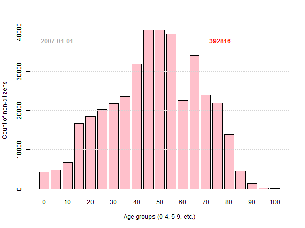

Nepilsoņu vecumstruktūra Latvijā: 5-gadu histogramma
-----

[Uz sākumu](http://www.demografija.lv)

* **Anotācija:** Dots pilsoņu un nepilsoņu skaits atkarībā no dzimšanas gada. 
Izveidot histogrammu, kas attēlotu nepilsoņu skaitu vecuma intervālos, intervāla garums 5 gadi. 
* **Pārskata šablons:** [age-histogram5.rmd](age-histogram5.rmd)
* **Izmantotie dati:** [DzGads-VPd-2007_2014.csv](DzGads-VPd-2007_2014.csv)
* **Iegūtā diagramma:** [age-histogram5.png](figure/age-histogram5.png)
* **Saistītie raksti:** [Datu iegūšana no PDF](http://www.dudajevagatve.lv/java-eim/de/dataproc-demography-pdf-data.html); [Datu apkopošana vienā CSV](http://www.dudajevagatve.lv/java-eim/de/dataproc-demography-load.html);
[Nepilsoņu vecumstruktūra Latvijā: 1-gada histogramma](age-histogram1.html)

Histogramma ir joslu diagrammas paveids - 
tā parāda, cik indivīdu ir katrā intervālā. Piederību intervālam nosaka 
kāda skaitliska atribūta vērtība. Piemēram, ja populācija ir visi Latvijas nepilsoņi, bet atribūts - cilvēka vecums (skaitliska vērtība), tad histogrammā var attēlot, cik nepilsoņu ir katrā vecuma grupā. Līdzīgi varētu veidot histogrammu, kas parāda nepilsoņu deklarēto dzīvesvietu attālumu no Rīgas. Savukārt, nepilsoņu dzimumus histogrammas veidā attēlot nevar, jo dzimums ir kvalitatīvs nevis kvantitatīvs atribūts.

Lai veidotu histogrammu, vispirms jānosaka intervāli jeb kārtošanas urnas (*sorting bins*). Šajā piemērā veidosim histogrammu, kurā iezīmēts, cik cilvēku ir vecumā no 0 līdz 4 gadiem, cik ir vecumā no 5 līdz 9 gadiem, cik no 10 līdz 14 gadiem, utt., visbeidzot - cik ir vecumā virs 100 gadiem (šis pēdējais intervāls ir garāks nekā citi - simtgadnieku vecumi ir robežās no 100 līdz aptuveni 110 gadiem). Gadu skaitu apaļojam uz leju - piemēram, cilvēks, kuram līdz 5 gadiem pietrūkst 1 diena joprojām skaitās 4 gadus vecs. Matemātiski pierakstot, visu iespējamo vecumu kopu $A$ pārklājam ar $n$ intervāliem: $A = I_1 \cup \ldots \cup I_{n}$. Mūsu gadījumā $n=21$ un visi intervāli (izņemot pēdējo) ir pusatvērti un 5 gadus gari:

$$A \subseteq [0,5) \cup [5,10) \cup [10,15) \cup \ldots \cup [95,100) \cup [100,+\infty)$$

Ja ar $X$ apzīmējam visu nepilsoņu kopu, tad pirms histogrammas zīmēšanas jāaprēķina, cik nepilsoņiem vecumi būs katrā intervālā. T.i. $i$-tais histogrammas stabiņš: $s_i = \left| \{ x \in X | age(x) \in I_i \} \right|$, kur $i \in \{1,\ldots,n\}$.


### Tabula: Nepilsoņu skaits vecuma grupās gada sākumā

Age | 2007 | 2008 | 2009 | 2010 | 2011 | 2012 | 2013 | 2014
---:|---:|---:|---:|---:|---:|---:|---:|---:|
0-4 |  4402 |  3988 |  3687 |  3371 |  2999 |  2500 |  2007 |  1563
5-9 |  4938 |  4474 |  4190 |  3924 |  3552 |  3250 |  2915 |  2620
10-14 |  6894 |  5508 |  4866 |  4424 |  4113 |  3736 |  3368 |  3051
15-19 | 16736 | 13229 | 10489 |  8257 |  6183 |  4660 |  3683 |  3145
20-24 | 18625 | 16904 | 15502 | 14187 | 12721 | 10845 |  8887 |  7011
25-29 | 20232 | 18592 | 17667 | 16540 | 15223 | 14017 | 12943 | 11723
30-34 | 21752 | 20531 | 19913 | 18983 | 17971 | 17028 | 15781 | 14734
35-39 | 23557 | 22257 | 21365 | 20873 | 20242 | 19214 | 18248 | 17652
40-44 | 31917 | 28698 | 26185 | 24051 | 22415 | 21165 | 20283 | 19331
45-49 | 40546 | 38561 | 36298 | 33980 | 31137 | 28563 | 25958 | 23757
50-54 | 40586 | 39437 | 39131 | 38105 | 36742 | 35614 | 33966 | 31757
55-59 | 39545 | 38816 | 37530 | 36182 | 34215 | 32583 | 31118 | 29919
60-64 | 22620 | 24388 | 27468 | 30693 | 32065 | 32481 | 31838 | 30360
65-69 | 34092 | 29768 | 25292 | 21605 | 18740 | 18129 | 19892 | 22661
70-74 | 24014 | 24950 | 26153 | 27418 | 27118 | 26446 | 23552 | 20197
75-79 | 21880 | 20862 | 19551 | 18221 | 17326 | 17670 | 18765 | 19823
80-84 | 13964 | 14432 | 14744 | 14748 | 14750 | 14311 | 13983 | 12886
85-89 |  4698 |  5229 |  5767 |  6420 |  6983 |  7542 |  7986 |  7971
90-94 |  1472 |  1383 |  1538 |  1563 |  1656 |  1871 |  2141 |  2250
95-99 |   290 |   356 |   406 |   471 |   486 |   458 |   432 |   387
100+ |    56 |    58 |    69 |    79 |    98 |   106 |   137 |    78

### Animēta histogramma

Sekojošā attēlā histogrammas mainās ik pēc 0.75 sekundēm - sākot no pārskata datuma "2007-01-01", "2007-07-01", "2008-01-01", ..., "2014-01-01" (pavisam kopā 15 histogrammas). Pēdējais attēls paliek 3.5 sekundes; pēc tam animācija atkārtojas. Animētā GIF veidošanai lietots rīks Imagemagick.


```r
if (!"animation" %in% installed.packages()) install.packages("animation")
library(animation)

getYear <- function(x) round(1970+as.numeric(as.Date(x))/365.25, digits=1)
df <- read.csv("DzGads-VPd-2007_2014.csv")
# histogram interval endpoints 
breaks <- 5*0:20
getSlices <- function(reportDate) {
  rYear <- getYear(reportDate)
  cnt <- df[df$ReportDate==reportDate,c("Year","LvNonCitizens")]
  sapply(1:length(breaks), function(i) {
    # add together those born in 1st and 2nd half of the year
    hy1 <- sum(cnt[findInterval(rYear-cnt$Year- 1E-7,breaks)==i,
                   "LvNonCitizens"])/2 
    hy2 <- sum(cnt[findInterval(rYear-cnt$Year- 0.5 - 1E-7,breaks)==i,
                   "LvNonCitizens"])/2
    hy1 + hy2
    })
  }


dsets <- c("2007-01-01", "2007-07-01", "2008-01-01", "2008-07-01", 
           "2009-01-01", "2009-07-01", "2010-01-01", "2010-07-01", 
           "2011-01-01", "2011-07-01", "2012-01-01", "2012-07-01", 
           "2013-01-01", "2013-07-01", "2014-01-01")

for (ii in 1:length(dsets)) {
  imgName <- sprintf("temp/animB%03d.png",ii)
  dset <- dsets[ii]
  png(filename=imgName, width=600,height=450)
  slices <- getSlices(dset)
  breakLabels <- breaks
  breakLabels[breaks %% 2 == 1] <- ""
  barplot(getSlices("2007-01-01"), col="white",
          border=NA,
          xlab="Age groups (0-4, 5-9, etc.)", 
          ylab="Count of non-citizens")
  barplot(slices, col="pink", names.arg=breakLabels, add=TRUE)
  # Draw only horizontal grid lines
  grid(nx=NA, ny=NULL)
  # Place the date above the grid, center it on the 2nd bar
  text(2, 38000, labels = dset, col="darkgray", 
       font=2)
  text(19, 38000, labels = as.character(round(sum(slices))), col="red", font=2)  
  dev.off()
  }
if (Sys.info()['sysname'] == "Windows") {
  cmdPrefix <- "cmd /c "
  } else { cmdPrefix <- "" } 
system(paste0(
  cmdPrefix,
  "convert -delay 75 -loop 0 temp/animB*.png animB.gif"
  ))   
```




*****

### Jautājumi
1. Vai, izmantojot PMLP datus varētu iegūt histogrammu, kurā 
vecumu intervāli ir īsāki nekā viens gads?
2. Valodā R ir īpaša funkcija histogrammu zīmēšanai **hist()**. 
Noskaidrot, vai ar šīs funkcijas palīdzību var histogrammas attēlu iegūt 
īsāk un vienkāršāk nekā augšminētajā piemērā? 


拉脱维亚“非公民”的年龄构成：五年的直方图 - Non-citizen age structure in Latvia: 5-year histogram  
*This report is available under a [Creative Commons License](http://creativecommons.org/licenses/by/4.0/deed.en_US)*
