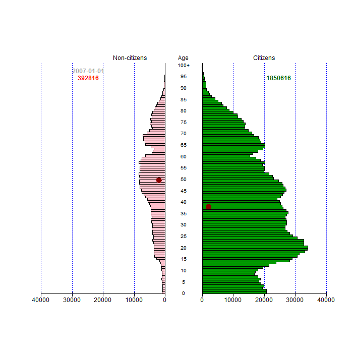

Pilsoņu un nepilsoņu vecuma piramīda
----------

[Uz sākumu](../index.html)

* **Anotācija:** Dots pilsoņu un nepilsoņu skaits atkarībā no dzimšanas gada. 
Izveidot vecuma piramīdu, kurā attēlots attiecīgi nepilsoņu un pilsoņu skaits. 
* **Pārskata šablons:** [population-pyramid.rmd](age-histogram5.rmd)
* **Datu pirmavots:** [Iedzīvotāju reģistra statistika](http://www.pmlp.gov.lv/lv/sakums/statistika/iedzivotaju-registrs/)
* **Tabulveida dati:** [DzGads-VPd-2007_2014.csv](DzGads-VPd-2007_2014.csv)
* **Iegūtā diagramma:** [pyramid.png](figure-static/pyramid.png)
* **Saistītie raksti:** [Nepilsoņu vecumstruktūra Latvijā: 1-gada histogramma](age-histogram1.html)

Šajā zīmējumā nepilsoņi un pilsoņi attēloti vienādā mērogā, tādēļ nepilsoņiem atbilstošās joslas izskatās diezgan īsas. Lai redzētu nepilsoņu vecuma struktūru atsevišķi, var skatīties [1-gada histogrammu](age-histogram1.html) vai [5-gadu histogrammu](age-histogram5.html).

Ar tumši sarkanu aplīti abās piramīdas pusēs atzīmēts pilsoņu un nepilsoņu vidējais vecums (*average age*) jeb visu vecumu aritmētiskais vidējais; savukārt ar baltu aplīti - pilsoņu un nepilsoņu vecumu mediāna (*median age*), t.i. vecums, par kuru puse populācijas ir jaunāki, otra puse - vecāki. Gan mediānas gan vidējās vērtības aprēķinā mēs izmantojam *vienmērības pieņēmumu* - uzskatām, ka jebkuram vecumam, cilvēku vecumi ir vienmērīgi sadalīti visa gada laikā. 


```r
if (!"animation" %in% installed.packages()) install.packages("animation")
if (!"plotrix" %in% installed.packages()) install.packages("plotrix")
if (!"pyramid" %in% installed.packages()) install.packages("pyramid")
library(animation)
library(plotrix)
library(pyramid)


getYear <- function(x) round(1970+as.numeric(as.Date(x))/365.25, digits=1)
df <- read.csv("DzGads-VPd-2007_2014.csv")
getSlices <- function(reportDate, colName) {
  cnt <- df[df$ReportDate==reportDate,colName]
  if (getYear(reportDate) == floor(getYear(reportDate))) {
    c(cnt[1:100], sum(cnt[101:length(cnt)]))
    }
  else {
    c(cnt[1] + 0.5*cnt[2], 
      0.5*(cnt[2:100] + cnt[3:101]), 
      0.5*cnt[101] + sum(cnt[102:length(cnt)]))
    }
  }


dsets <- c("2007-01-01", "2007-07-01", "2008-01-01", "2008-07-01", 
           "2009-01-01", "2009-07-01", "2010-01-01", "2010-07-01", 
           "2011-01-01", "2011-07-01", "2012-01-01", "2012-07-01", 
           "2013-01-01", "2013-07-01", "2014-01-01")

for (ii in 1:length(dsets)) {
  imgName <- sprintf("temp/animC%03d.png",ii)
  dset <- dsets[ii]
  png(filename=imgName, width=700,height=700)
  # Create a dataframe - 
  # (1) 101 noncitizen annual slices, 
  # (2) 101 citizen annual slices
  # (3) numbers from 0 to 99 appended by "100+"
  nonCitsData <- getSlices(dset, "LvNonCitizens")
  citsData <- getSlices(dset, "LvCitizens")
  nonCitsMeanAge <- sum(c(1:100-0.5,102)*nonCitsData)/sum(nonCitsData)
  citsMeanAge <- sum(c(1:100-0.5,102)*citsData)/sum(citsData)
  data <- data.frame(nonCitsData,citsData,c(0:99,"100+"))
  pyramid(data,Lcol="Pink",Rcol="#009900",
          Llab="                                    Non-citizens",
          Rlab="Citizens", Clab="Age", 
          AxisFM="d", AxisBM="",
          Laxis=seq(0,40000,length.out=5), 
          Csize=0.8, Cstep =5, Cadj=-0.02)
  
  draw.circle(-0.2,nonCitsMeanAge/101,0.02,col="darkred", border="darkred")
  draw.circle(0.2,citsMeanAge/101,0.02,col="darkred", border="darkred")
  text(-0.77, 0.97, labels = dset, col="darkgray", 
       font=2)  
  text(-0.77, 0.94, labels = round(sum(nonCitsData)), col="red", 
       font=2)  
  text(0.77, 0.94, labels = round(sum(citsData)), col="darkgreen", 
       font=2)
  dev.off()
  }
if (Sys.info()['sysname'] == "Windows") {
  cmdPrefix <- "cmd /c "
  } else { cmdPrefix <- "" } 
system(paste0(
  cmdPrefix,
  "convert -delay 75 -loop 0 temp/animC*.png animC.gif"
  ))   
```




公民和“非公民”的人口金字塔 — Citizen and non-citizen population pyramid  
*This report is available under a [Creative Commons License](http://creativecommons.org/licenses/by/4.0/deed.en_US)*

