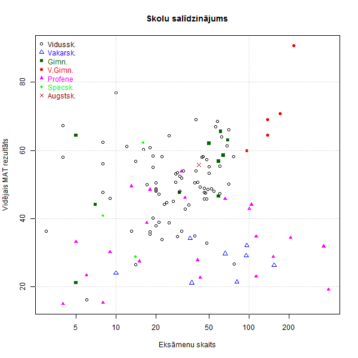
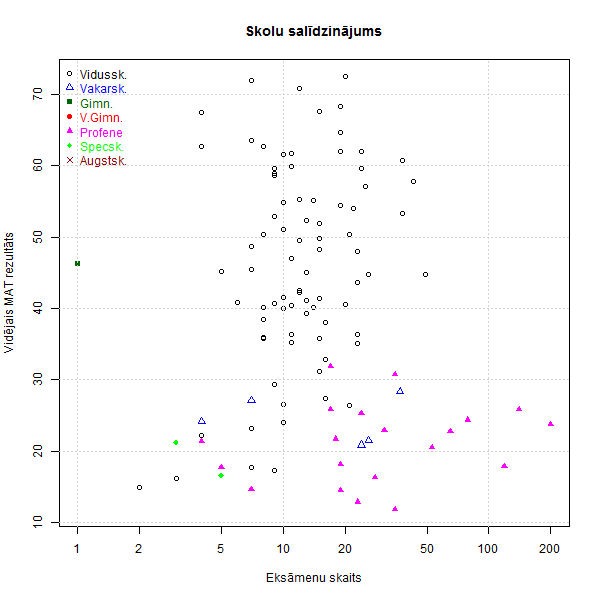
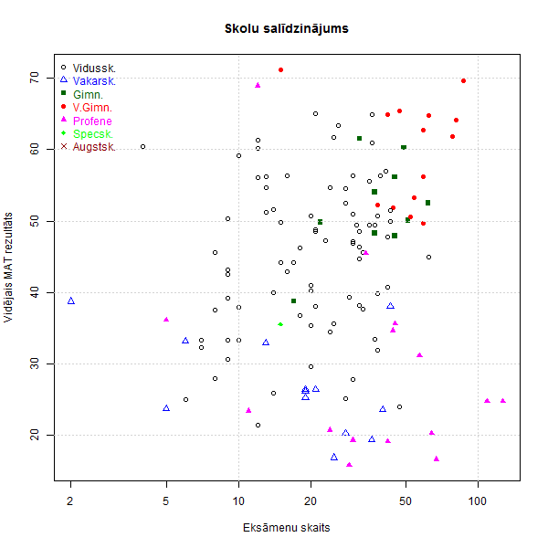
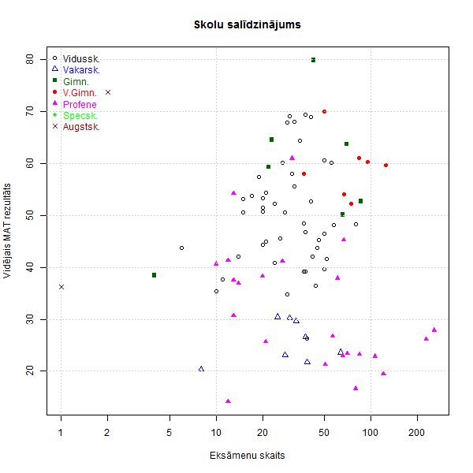

[Uz sākumu](../index.html)

# Skolas lielums un eksāmenu rezultāti

Šajā praktiskajā darbā jāizveido 4 grafiki - 12.klases matemātikas centralizētā eksāmena rezultātu atkarība no skolas izmēra (t.i. no to cilvēku skaita, kas kārtoja šo eksāmenu). 

Katrs aplītis attēlo vienu skolu. X-koordināte ir skolēnu skaits, kas beidza 12.klasi (t.i. matemātikas eksāmenu kārtojušo skaits). 

1. Rīgā
2. Citās lielajās pilsētās (Liepājā, Ventspilī, Jelgavā, Jūrmalā, Valmierā, Jēkabpilī, Rēzeknē, Daugavpilī)
3. Pārējās pilsētās
4. Laukos

## Eksāmenu datu skaidrojums

* [2014_centralizetie.csv](sampledata/2014_centralizetie.csv) - Datu fails CSV formātā - katra rindiņa ir viena eksāmena rezultāts. 
* [RMD šablons](exams-by-school-size.rmd)
* Sk. [lauku skaidrojumu](https://docs.google.com/document/d/1bPRGH1yKoyAmt-1N0AP3k_T-qWuuRr_PHSb2xf5l5KU/edit?usp=sharing)
* **df$nosaukums** - skolas nosaukums. 
* **df$prieksmets** - priekšmets (piemēram "MAT" - matemātika)
* **df$tips** - skolas tips
    * 1 - sākumskola (nav centralizēto eksāmenu)
    * 2 - pamatskola (nav centralizēto eksāmenu)
    * 3 - vidusskola
    * 4 - vakarskola
    * 5 - ģimnāzija
    * 6 - valsts ģimn.
    * 7 - profenes, mākslas skolas uc.
    * 8 - spec.skolas
* **df$koppro** - kopvērtējums par eksāmenu (% no maksimuma)

## Rīga

```{r fig1, echo=FALSE, error=FALSE, warning=FALSE, }
png(filename="fig-riga.png", width=600,height=600)

setwd("/home/st/demografija-lv/visc/sampledata/")
df = read.table(
  file="2014_centralizetie.csv", 
  header=TRUE,
  sep=",",
  row.names=NULL,  
  fileEncoding="UTF-8"
)

# Atfiltree tikai tos, kam "prieksmets" == "MAT"
mat12 <- df[df$prieksmets=="MAT" & df$urban ==1,]

mat12$nosaukums <- factor(mat12$nosaukums)

schoolTable <- table(mat12$nosaukums)
schools <- names(schoolTable)
peopleNum <- unname(as.vector(schoolTable))

schoolRes <- numeric(0)
schoolType <- numeric(0)
for (i in 1:length(schools)) {
  schoolRes <- c(schoolRes, mean(mat12$koppro[mat12$nosaukums == schools[i]]))
  schoolType <- c(schoolType,mat12$tips[mat12$nosaukums == schools[i]][1])
}

colors <- c("black","blue","darkgreen","red","magenta","green","darkred")
shapes <- c(1,2,15,16,17,18,4)

plot(peopleNum, schoolRes, log="x", 
     col=colors[schoolType-2], pch = shapes[schoolType-2], 
     xlab="Eks\u0101menu skaits",
     ylab="Vid\u0113jais MAT rezult\u0101ts",
     main="Skolu sal\u012Bdzin\u0101jums")
grid()
legend("topleft", 
        inset = c(0,0), 
        cex = 1, 
        bty = "n", 
        legend = c("Vidussk.", "Vakarsk.",
                   "Gimn.","V.Gimn.",
                   "Profene","Specsk.","Augstsk."), 
        text.col = colors,
        col = colors, 
        pch = shapes)


dev.off()
```





## Lauki


```{r fig-lauki, echo=FALSE, error=FALSE, warning=FALSE, }
png(filename="fig-lauki.png", width=600,height=600)

setwd("/home/st/demografija-lv/visc/sampledata/")
df = read.table(
  file="2014_centralizetie.csv", 
  header=TRUE,
  sep=",",
  row.names=NULL,  
  fileEncoding="UTF-8"
)

# Atfiltree tikai tos, kam "prieksmets" == "MAT"
mat12 <- df[df$prieksmets=="MAT" & df$urban ==4,]

mat12$nosaukums <- factor(mat12$nosaukums)

schoolTable <- table(mat12$nosaukums)
schools <- names(schoolTable)
peopleNum <- unname(as.vector(schoolTable))

schoolRes <- numeric(0)
schoolType <- numeric(0)
for (i in 1:length(schools)) {
  schoolRes <- c(schoolRes, mean(mat12$koppro[mat12$nosaukums == schools[i]]))
  schoolType <- c(schoolType,mat12$tips[mat12$nosaukums == schools[i]][1])
}

colors <- c("black","blue","darkgreen","red","magenta","green","darkred")
shapes <- c(1,2,15,16,17,18,4)

plot(peopleNum, schoolRes, log="x", 
     col=colors[schoolType-2], pch = shapes[schoolType-2], 
     xlab="Eks\u0101menu skaits",
     ylab="Vid\u0113jais MAT rezult\u0101ts",
     main="Skolu sal\u012Bdzin\u0101jums")
grid()
legend("topleft", 
        inset = c(0,0), 
        cex = 1, 
        bty = "n", 
        legend = c("Vidussk.", "Vakarsk.",
                   "Gimn.","V.Gimn.",
                   "Profene","Specsk.","Augstsk."), 
        text.col = colors,
        col = colors, 
        pch = shapes)


dev.off()
```





## Mazpilsētas


```{r fig-mazpilsetas, echo=FALSE, error=FALSE, warning=FALSE, }
png(filename="fig-mazpilsetas.png", width=600,height=600)

setwd("/home/st/demografija-lv/visc/sampledata/")
df = read.table(
  file="2014_centralizetie.csv", 
  header=TRUE,
  sep=",",
  row.names=NULL,  
  fileEncoding="UTF-8"
)

# Atfiltree tikai tos, kam "prieksmets" == "MAT"
mat12 <- df[df$prieksmets=="MAT" & df$urban ==3,]

mat12$nosaukums <- factor(mat12$nosaukums)

schoolTable <- table(mat12$nosaukums)
schools <- names(schoolTable)
peopleNum <- unname(as.vector(schoolTable))

schoolRes <- numeric(0)
schoolType <- numeric(0)
for (i in 1:length(schools)) {
  schoolRes <- c(schoolRes, mean(mat12$koppro[mat12$nosaukums == schools[i]]))
  schoolType <- c(schoolType,mat12$tips[mat12$nosaukums == schools[i]][1])
}

colors <- c("black","blue","darkgreen","red","magenta","green","darkred")
shapes <- c(1,2,15,16,17,18,4)

plot(peopleNum, schoolRes, log="x", 
     col=colors[schoolType-2], pch = shapes[schoolType-2], 
     xlab="Eks\u0101menu skaits",
     ylab="Vid\u0113jais MAT rezult\u0101ts",
     main="Skolu sal\u012Bdzin\u0101jums")
grid()
legend("topleft", 
        inset = c(0,0), 
        cex = 1, 
        bty = "n", 
        legend = c("Vidussk.", "Vakarsk.",
                   "Gimn.","V.Gimn.",
                   "Profene","Specsk.","Augstsk."), 
        text.col = colors,
        col = colors, 
        pch = shapes)


dev.off()
```





## Lielpilsētas


```{r fig-lielpilsetas, echo=FALSE, error=FALSE, warning=FALSE, }
png(filename="fig-lielpilsetas.png", width=600,height=600)

setwd("/home/st/demografija-lv/visc/sampledata/")
df = read.table(
  file="2014_centralizetie.csv", 
  header=TRUE,
  sep=",",
  row.names=NULL,  
  fileEncoding="UTF-8"
)

# Atfiltree tikai tos, kam "prieksmets" == "MAT"
mat12 <- df[df$prieksmets=="MAT" & df$urban ==2,]

mat12$nosaukums <- factor(mat12$nosaukums)

schoolTable <- table(mat12$nosaukums)
schools <- names(schoolTable)
peopleNum <- unname(as.vector(schoolTable))

schoolRes <- numeric(0)
schoolType <- numeric(0)
for (i in 1:length(schools)) {
  schoolRes <- c(schoolRes, mean(mat12$koppro[mat12$nosaukums == schools[i]]))
  schoolType <- c(schoolType,mat12$tips[mat12$nosaukums == schools[i]][1])
}

colors <- c("black","blue","darkgreen","red","magenta","green","darkred")
shapes <- c(1,2,15,16,17,18,4)

plot(peopleNum, schoolRes, log="x", 
     col=colors[schoolType-2], pch = shapes[schoolType-2], 
     xlab="Eks\u0101menu skaits",
     ylab="Vid\u0113jais MAT rezult\u0101ts",
     main="Skolu sal\u012Bdzin\u0101jums")
grid()
legend("topleft", 
        inset = c(0,0), 
        cex = 1, 
        bty = "n", 
        legend = c("Vidussk.", "Vakarsk.",
                   "Gimn.","V.Gimn.",
                   "Profene","Specsk.","Augstsk."), 
        text.col = colors,
        col = colors, 
        pch = shapes)


dev.off()
```





一二三四五