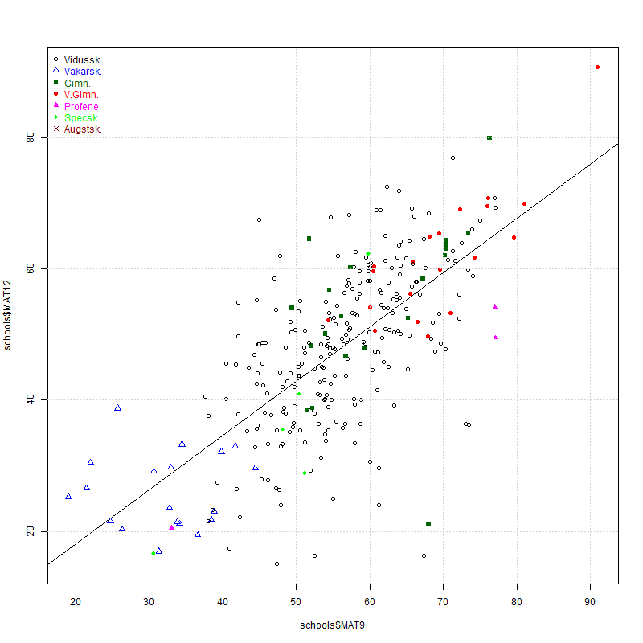

[Uz sākumu](../index.html)

# MAT9 un MAT12 salīdzinājums

_Šajā pārskatā jāzīmē 
matemātikas eksāmenu salīdzinājums
2011.g. 9.klasei un 2014.g. 12.klasei (t.i. 12.klases
datus skatāmies tieši 3 gadus vēlāk)._

Skolas vēlams iekrāsot atbilstoši to tipam. 
VISC datos pazīstami sekojoši skolu tipi: 

* 1 - sākumskolas (eksāmenu rezultātos neparādīsies)
* 2 - pamatskolas (parādīsies tikai 9.kl. rezultāti)
* 3 - vidusskolas
* 4 - vakarskolas
* 5 - ģimnāzijas
* 6 - valsts ģimnāzijas
* 7 - profenes, mākslas skolas u.c.
* 8 - spec.skolas - bērniem ar dažāda veida traucējumiem

Kas ir jāizmaina šajā prototipā: 
1. Grafiks ir dots vienīgi par MAT9 vs. MAT12 (t.i. 
salīdzināti matemātikas rezultāti). Vajadzētu arī angļu valodu (ANG9, ANG12) un latviešu valodu (VLL9, VLL12). Tātad --- pavisam vajadzīgi 3 grafiki.

## Faili

* [2014_centralizetie.csv](sampledata/2014_centralizetie.csv) - 12.klases eksāmeni; Datu fails CSV formātā - katra rindiņa ir viena eksāmena rezultāts. 
* [2011-necentralizetie-MAT9.csv](sampledata/2011-necentralizetie-MAT9.csv) --- 9.klases eksāmeni. Katra rindiņa ir vienas skolas vidējais rezultāts.
* [RMD šablons](exams-by-school-type.rmd)


```{r fig-mat-comparison}
if (!"dplyr" %in% installed.packages()) install.packages("dplyr")

library(dplyr)

png(filename="fig-mat-comparison.png", width=800,height=800)
# Change to your directory
setwd("/home/st/demografija-lv/visc/sampledata/")

# 12.klases eksāmeni
centr12 <- read.table(
  file="2014_centralizetie.csv", 
  header=TRUE,
  sep=",",quote="\"",
  fileEncoding="UTF-8")

schools12 <- centr12 %>% 
  group_by(nosaukums, prieksmets) %>%
  summarise(koppro = mean(koppro), tips = mean(tips), 
            nn = n())


schoolsMAT12 <- schools12[schools12$prieksmets=="MAT",]

# 9.klases eksāmeni
schoolsMAT9 <- read.table(
  file="2011-necentralizetie-MAT9.csv", 
  header=TRUE,
  sep=",",quote="\"",
  fileEncoding="UTF-8")

schools <- merge(schoolsMAT9, schoolsMAT12, 
                 by.x = "Skola", 
                 by.y = "nosaukums")

schools$MAT9 <- as.numeric(sub("%","",schools$Kopvertejums))
schools$MAT12 <- as.numeric(round(schools$koppro, digits=2))
colors <- c("black","blue","darkgreen","red","magenta","green","darkred")
shapes <- c(1,2,15,16,17,18,4)


plot(schools$MAT9, schools$MAT12, 
     col=colors[schools$tips-2], pch = shapes[schools$tips-2],)
legend("topleft", 
        inset = c(0,0), 
        cex = 1, 
        bty = "n", 
        legend = c("Vidussk.", "Vakarsk.",
                   "Gimn.","V.Gimn.",
                   "Profene","Specsk.","Augstsk."), 
        text.col = colors,
        col = colors, 
        pch = shapes)
# Lineārās regresijas taisne:
reg1 <- lm(schools$MAT12 ~ schools$MAT9)
abline(reg1)
grid()

dev.off()
```



Neizdzēst šo rindu, jo tā palīdz latviešu burtu pareizam kodējumam
一二三四五

